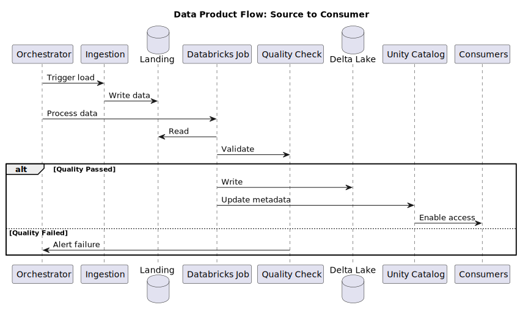

# DPAS Data Platform Architecture & Strategy

**Scope** : This document covers **ONLY** the DPAS Data Platform architecture only within DPAS components and internal teams developing the platform.

---

# Some Facts

## Assumptions & Anti‑Patterns Called Out (Challenge the Brief)

* **Anti‑pattern: "Central platform builds all data products."**
  - [ ] This violates Data Mesh. Domain teams must own pipelines and product SLOs; 
  - [ ] The DPAS platform provides paved roads and guardrails.

* **Anti‑pattern: Centralise SFTP as a primary ingestion tier for mission‑critical feeds from Mainframe.**
  - [ ] Acceptable for interim Mainframe migration and modernisation only. 
  - [ ] For mainframe and RDBMS sources, **CDC** (e.g., IBM/Precisely/Qlik) or **event streaming** is the standard to meet freshness/SLA and auditability.

* **Anti‑pattern: One Databricks workspace for the entire platfrom per env ( Dev/QA/Prod ).**
  - [ ] Hard to isolate blast radius and costs. 
  - [ ] Use **per‑domain workspaces** with **Unity Catalog** enforcing global policies.

* **Anti‑pattern: Multiple orchestrators without a "system of record."**
  - [ ] Leads to broken SLAs and unclear ownership.
  - [ ] Use a **scheduler‑of‑record** for cross‑domain + legacy coordination, and allow domain‑level orchestrators behind API/event contracts.

* **Anti‑pattern: Proprietary table formats that lock analytics to one engine.**
  - [ ] Mandate **open table format semantics** (Delta Lake OSS with UniForm) and **open file formats** at the edges.

## Assumptions & Anti‑Patterns Called Out (Challenge the Brief)

* **Anti‑pattern: "Central platform builds all data products."**
  This violates Data Mesh. Domain teams must own pipelines and product SLOs; the platform provides paved roads and guardrails.

* **Anti‑pattern: SFTP as a primary ingestion tier for mission‑critical feeds.**
  Acceptable for noncritical batch or interim migration only. For mainframe and RDBMS sources, **CDC** (e.g., IBM/Precisely/Qlik) or **event streaming** is the standard to meet freshness/SLA and auditability.

* **Anti‑pattern: One Databricks workspace for the entire bank.**
  Hard to isolate blast radius and costs. Use **per‑domain workspaces** with **Unity Catalog** enforcing global policies.

* **Anti‑pattern: Multiple orchestrators without a "system of record."**
  Leads to broken SLAs and unclear ownership. Use a **scheduler‑of‑record** for cross‑domain + legacy coordination, and allow domain‑level orchestrators behind API/event contracts.

* **Anti‑pattern: Proprietary table formats that lock analytics to one engine.**
  Mandate **open table format semantics** (Delta Lake OSS with UniForm) and **open file formats** at the edges.

---

## Some of the Things we're weirdly Good at 😀

- [ ] **Guess-Driven Development**: We are SMEs and Transform data based on what we think the business meant.

- [ ] **Deadline Obedience**: We **Ship** on time, every time. But **Quality** and **sanity** are optional variables.

- [ ] **Being "The Experts"**: We know just enough about our tech stack to sound convincing in meetings.

- [ ] **Wish Fulfillment**: We say "yes" to so many custom requests that our core product is now just a collection of side-quests.

- [ ] **Pain Farming**: We masterfully plant seeds of technical debt that will blossom into a magnificent harvest of emergencies later.

---

## What needs to be done? 👨🏻‍⚖️

### The "Oh Crap, We actually have to fix this" List

- [ ] **Untangle the Spaghetti**: Figure out what the hell our data transformation code is actually doing and why it cries when we look at it.

- [ ] **Stop Lying to Ourselves:** Admit that the deadlines are pure fantasy, we don't have every capability in the world built yesterday and build a plan that involves less caffeine-fueled panic and more actual engineering.

- [ ] **Read the Manual**: Get at least one person in the room (each pod) to understand our tech stack beyond the first page of a "**Getting Started**" guide.

- [ ] **Build One Thing, Not Fifty**: Stop building a thousand custom "solutions" and start building a single, usable platform. This may require learning the word "**no**."

- [ ] **Pay the Piper**: Finally look our technical debt in its cold, dead eyes and start chipping away at the mountain of "**we'll fix it laters.**"

---

## Part 1: Foundational Architecture and Strategy

### 1.1 Data Mesh & Lakehouse Synthesis

**How they coexist**

* **Lakehouse** provides the unified storage & compute substrate (ADLS Gen2 + Databricks) with **open table format (Delta Lake OSS)**, ACID, time travel, and performance features.
* **Data Mesh** enforces **domain ownership** of **Data products** (Gold) and **Transformation logic** (Bronze/Silver) inside **domain data planes**.
* **Federated computational governance**: central **control plane** defines **non‑negotiable guardrails** (identity, policy, classification, lineage, quotas, DR), while **domain teams** configure within those guardrails.

**Operating model (RACI, summarized)**

* **Platform (Control Plane)** – ***Responsible**/**Accountable** for **guardrails** & **enablement***

  * **Standards**: formats, SLAs/SLOs, security baselines, cluster policies
  * Global **data catalog**, **lineage**, **classifications**, **masking policies**
  * **Self‑service** portal, APIs (control plane), templates, **CI/CD**, **observability**, **FinOps**
  * **System-of-record** orchestration and **cross‑domain** scheduling

* **Domain Teams (Data Planes)** – ***Responsible**/**Accountable** for products*

  * Ingestion from domain sources (or **subscribe to shared sources**)
  * **Transformations** (Bronze→Silver→Gold), data contracts, DQ checks
  * **Meeting product SLOs** (freshness, quality, availability)
  * Cost stewardship within quotas; participate in governance forums

* **Risk/Security/Compliance** – *Consulted/Informing enforcement*

  * Review and test policies in lower envs; attestations & evidence

---

### 1.2 Control Plane vs Data Plane

**Control Plane (Global, shared services)**
Core responsibilities:

* **Identity & Access**: Entra ID auth/SCIM provisioning, ABAC/RBAC via Unity Catalog, workload identities, key rotation.
* **Governance**: Policy-as-code in Unity Catalog (tags, masking, PII), cross-platform discovery, data retention.
* **Catalog & Lineage**: Product registry, end-to-end lineage via Unity Catalog + OpenLineage.
* **Self-Service**: Portal, API gateway, templates (Terraform/ARM/notebooks/DLT), quality frameworks.
* **Orchestration**: Enterprise scheduler for cross-domain/mainframe coordination, event standards, change windows.
* **Observability**: OpenTelemetry collection, SLO monitoring, incident management.
* **FinOps**: Budgets, cost allocation, auto-suspend, cluster policies, tag governance.
* **Security**: Hub-spoke networking, Private Link, egress control, Key Vault HSM with double encryption.
* **Resilience**: Region failover, metastore replication, RPO/RTO tiers, DR procedures.

**Data Plane (Per domain)**
Core responsibilities:

* **Ingestion**: Domain CDC connectors; onboard files/datasets via central pipeline; event streams.
* **Transformations**: Databricks jobs (Spark/SQL/DLT) for batch/streaming; quality checks (DQX/GE/Soda); enforce contracts.
* **Storage**: 
    * Landing (ADLS raw): Immutable, partitioned, one container per domain
    * Bronze/Silver/Gold: Delta Lake tables with optimized layouts (Z‑order, clustering)
* **Compute**: Domain‑specific job clusters with control plane policies; shared pools for efficiency.
* **Product Exposure**: SQL warehouses, Delta Sharing, APIs via APIM gateway.
* **Domain Observability**: Pipeline metrics, quality results, cluster usage, data SLOs → central OpenTelemetry collection.

---

### 1.3 Open‑Source Format Standards (with rationale)

* **Raw Ingestion (Landing Zone)**
    * **Mainframe data**: Store as **Avro** (binary) with schema, types intact; compress with **zstd**
    * **Relational data**: Use **Avro**/**Parquet** for batch; **CDC** events with **Avro**/**JSON Schema**
    * **Logs/JSON**: Use **JSON Lines** (UTF‑8, GZIP optional); for large volumes use **Parquet**

* **Cleansed Data (Bronze/Silver)**
    * Use **Delta Lake** as the primary table format
    * Use **Schema** enforcement to match DB2 schema of all tables and correct any schema drift due to mainframe unlaod process
    * Leverage **Delta UniForm** for Iceberg/Hudi compatibility

* **Data Products (Gold)**
    * Use **Delta Lake** for internal products
    * Use **Delta Sharing** for external sharing
    * Export as **Parquet** only when Delta isn't supported

### 1.4 Orchestration Strategy (ADF → Target State)

**Context:** Hybrid environment with mainframe and cloud workloads requiring Autosys replacement to move Autosys & ADF coupled batches in the DPAS platform.

**Strategy:**

* **Current State:** Legacy Autosys orchestration
* **Target State:** Modern enterprise orchestrator supporting:
    * Mainframe and cloud workloads
    * Event-driven patterns (Kafka)
    * Azure native integration
    * Cross-subscription management

**Decision Path:**

* Detailed analysis completed ([see batch-scheduling-autosys-alternatives.md](../analysis/batch-scheduling-autosys-alternatives.md))
* CTO decision required between enterprise platforms:
    * BMC Control-M
    * Stonebranch UAC
    * Tidal Automation

**Recommendation**

* **Enterprise scheduler‑of‑record: Control‑M.**
  It is the only option of the three that **natively** spans **mainframe + cloud** with **bank‑grade SLAs, calendars, approvals, and audit**. Use it to coordinate windowed batch, trigger domain orchestrators, and enforce change governance.

* **Domain‑level orchestrator: Dagster (preferred) or Airflow.**
  Domains build pipelines/assets close to their code and product contracts. Control‑M triggers domain orchestrations via APIs/events and ingests their run status/SLOs.

  * If forced to pick a **single engine** for the entire hybrid estate: **Control‑M**.

**Implementation Approach:**

* Phase 1: CTO platform selection
* Phase 2: POC with selected vendor
* Phase 3: Migration planning
* Phase 4: Phased rollout by domain

**Post-Decision Architecture:**

* Enterprise orchestrator for cross-platform workflows
* Domain-specific patterns using native Azure services
* Event-driven integration via Kafka
* Azure-native security and monitoring

## Part 2: Platform and Governance

Decision : The below Patform and Governance controls will be reviewed with technology partners like **Databricks** and other vendors and overall UBS alignment

### **Summary**

### 2.1 Self-Service Capabilities
- Interactive product onboarding
- Automated resource provisioning
- Pre-configured pipeline templates
- Data quality monitoring tools
- Centralized schema management
- Role-based access control
- Performance monitoring and SLAs
- Automated deployment workflows
- Usage and cost tracking

### 2.2 Platform Features
#### Core Functions
- Executive dashboard
- Data product catalog
- Pipeline orchestration
- Schema versioning
- Quality metrics
- Access controls

#### Operations
- Resource management
- System monitoring
- Cost optimization
- Data exchange
- Compliance tracking

### 2.3 API Infrastructure
#### Management APIs
- Product lifecycle
- Resource provisioning
- Authentication and authorization
- Schema validation
- Quality assurance

#### Operational APIs
- Data lineage
- Pipeline execution
- Cost reporting

### **Details**

### 2.1 Self‑Service Capabilities (paved‑road)

* **Data Product Onboarding Wizard**

  * Creates **UC catalog/schema**, ADLS containers, workspace, cluster policies, repos, CI/CD, SLO templates, DQ scaffolds, tags/labels, and FinOps budget.

* **Automated Compute Provisioning**

  * Opinionated **cluster policies** (photon, auto‑terminate, pools), serverless SQL warehouses, job clusters; GPU templates when approved.

* **Pipeline Blueprints**

  * Templates for **batch CDC**, streaming (Event Hubs/Kafka → DLT), file ingestion (Avro/Parquet), and contract‑first transformations (Bronze→Silver→Gold).

* **Data Quality Setup**

  * Scaffold **Great Expectations/Soda** suites, thresholds, quarantine paths, alert routes; pre‑wired to lineage and SLO dashboards.

* **Data Contract & Schema Registry**

  * JSON Schema/Avro contract registry; breaking‑change checks; consumer‑driven contract tests.

* **Access & Sharing**

  * One‑click access requests (row/column masking + tags), **Delta Sharing** recipient provisioning, token lifecycle, data use attestations.

* **Observability & SLOs**

  * Out‑of‑the‑box dashboards: freshness, completeness, timeliness, cost/unit, lineage, and incident runbooks.

* **CI/CD for Data**

  * Branch protections, environment promotions, **table change reviews**, data diffs/sampling gates, **quality gates** pre‑prod, artifact registries (wheels, bundles).

* **FinOps Guardrails**

  * Budgets, auto‑suspend, cost anomaly alerts, resource quotas per domain/product.

---

### 2.2 Platform Portal (Custom UI) — Key Panes

* **Home & Scorecards**: Org‑wide SLA/SLO heatmaps, latest incidents, cost overview.
* **Products**: Create/view products; status, owners, schemas, SLOs, lineage map, access policies; publish/release notes.
* **Pipelines**: Runs, dependencies, backfills; deploy/promote; approve change windows.
* **Schemas & Contracts**: Register/edit schemas, contract tests, diff/breaking‑change analysis.
* **Quality**: DQ suites, failed expectations, quarantines, sample drift.
* **Access**: Request/grant view; ABAC tags; masking previews; audit trails.
* **Compute**: Request clusters/warehouses; policy compliance; utilization.
* **Observability**: Logs/metrics/traces; data SLO dashboards; alert routing.
* **FinOps**: Budgets, spend by product, unit‑cost KPIs.
* **Sharing**: Delta Sharing recipients, tokens, usage analytics.
* **Runbooks & Compliance**: DR drills, playbooks, attestations, evidence export.

---

### 2.3 Control Plane APIs (Gateway Endpoints)

* **Data Product Catalog API**

  * `POST /products` – register new product (owner, domain, SLOs, tags)
  * `GET /products/{id}` – product metadata, lineage root, ACLs
  * `GET /products/{id}/schema` – active schema & versions
  * `POST /products/{id}/release` – publish a new product version

* **Compute Management API**

  * `POST /clusters` – provision job cluster from policy template
  * `DELETE /clusters/{id}` – decommission with evidence capture
  * `POST /sql-warehouses` – create governed SQL endpoint
  * `GET /compute/{id}/utilization` – usage & cost metrics

* **Access Control API**

  * `POST /grants` – grant dataset access with ABAC tags + masking policy
  * `DELETE /grants/{id}` – revoke; record audit
  * `POST /sharing/recipients` – create Delta Sharing recipient
  * `POST /policies/masking` – define dynamic masking by tag/classification

* **Schema & Contract API**

  * `POST /schemas` – register JSON Schema/Avro; attach to product
  * `POST /contracts` – register contract; link producer/consumers
  * `POST /contracts/{id}/validate` – run breaking‑change check

* **Quality & SLO API**

  * `POST /dq/suites` – create expectation suite
  * `POST /slo` – set targets (freshness, completeness)
  * `GET /slo/{productId}` – current status & burn rate

* **Lineage & Observability API**

  * `POST /lineage/events` – OpenLineage payload ingest
  * `GET /lineage/{productId}` – graph/edges
  * `POST /alerts/routes` – subscribe on conditions

* **Orchestration API**

  * `POST /runs` – request domain pipeline run (idempotent)
  * `POST /runs/{id}/status` – domain orchestrator callback
  * `POST /maintenance/windows` – schedule/approve freeze windows

* **FinOps API**

  * `POST /budgets` – set per‑domain/product budgets
  * `GET /spend/{productId}` – showback/chargeback details

---

## Part 3: Architectural Diagrams

### 3.1 High‑Level System Architecture

### 3.2 Core Data Flow Sequence

### 3.3 Platform Components

### 3.3 Platform Components

The following diagram shows the core platform components and their relationships:

Key relationships:
- Identity manages Access Control authentication
- Catalog coordinates with Storage for data asset management
- Scheduler triggers Processing jobs
- Processing outputs feed into Quality checks
- Quality metrics flow to Monitoring
- Storage exposes data through APIs
- Policies govern Processing operations

These components form the foundation of our data platform architecture, enabling secure and efficient data operations while maintaining governance standards.

