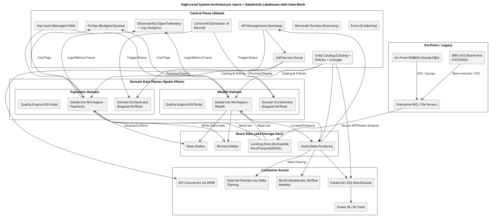
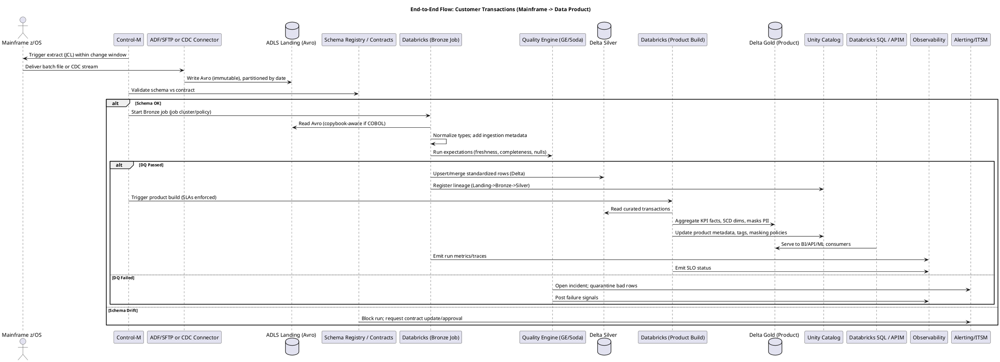
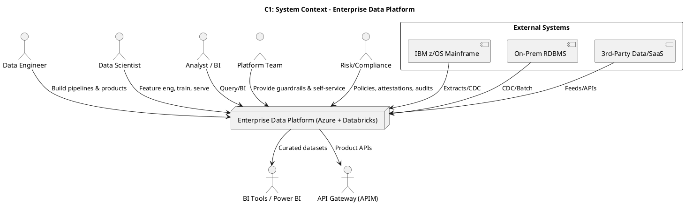
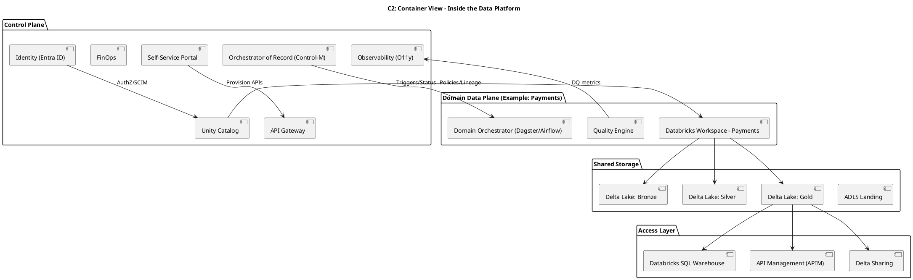
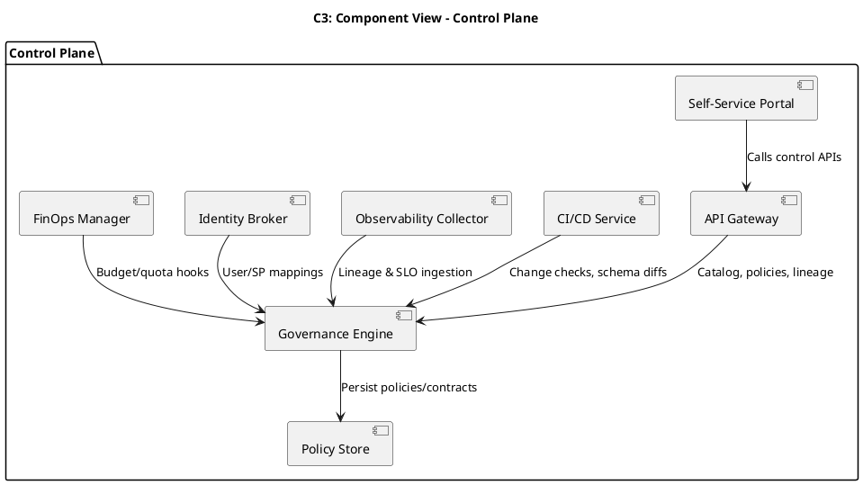
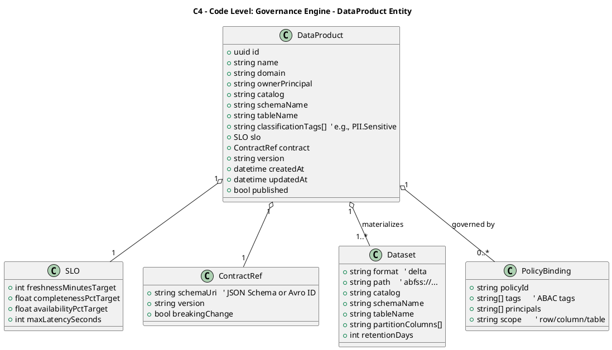

Below is a **critical, bank-grade** target architecture that synthesizes **Data Mesh** with a **Databricks-centric Lakehouse on Azure**, with explicit control-plane/data-plane separation, open formats, and an orchestration strategy fit for hybrid mainframe + cloud operations. I call out anti‑patterns where relevant and back each recommendation with rationale.

---

## Assumptions & Anti‑Patterns Called Out (Challenge the Brief)

* **Anti‑pattern: "Central platform builds all data products."**
  This violates Data Mesh. Domain teams must own pipelines and product SLOs; the platform provides paved roads and guardrails.

* **Anti‑pattern: SFTP as a primary ingestion tier for mission‑critical feeds.**
  Acceptable for noncritical batch or interim migration only. For mainframe and RDBMS sources, **CDC** (e.g., IBM/Precisely/Qlik) or **event streaming** is the standard to meet freshness/SLA and auditability.

* **Anti‑pattern: One Databricks workspace for the entire bank.**
  Hard to isolate blast radius and costs. Use **per‑domain workspaces** with **Unity Catalog** enforcing global policies.

* **Anti‑pattern: Multiple orchestrators without a "system of record."**
  Leads to broken SLAs and unclear ownership. Use a **scheduler‑of‑record** for cross‑domain + legacy coordination, and allow domain‑level orchestrators behind API/event contracts.

* **Anti‑pattern: Proprietary table formats that lock analytics to one engine.**
  Mandate **open table format semantics** (Delta Lake OSS with UniForm) and **open file formats** at the edges.

---

## Part 1: Foundational Architecture and Strategy

### 1.1 Data Mesh & Lakehouse Synthesis

**How they coexist**

* **Lakehouse** provides the unified storage & compute substrate (ADLS Gen2 + Databricks) with **open table format (Delta Lake OSS)**, ACID, time travel, and performance features.
* **Data Mesh** enforces **domain ownership** of data products (Gold) and transformation logic (Bronze/Silver) inside **domain data planes**.
* **Federated computational governance**: central **control plane** defines non‑negotiable guardrails (identity, policy, classification, lineage, quotas, DR), while **domain teams** configure within those guardrails.

**Operating model (RACI, summarized)**

* **Platform (Control Plane)** – *Responsible/Accountable for guardrails & enablement*

  * Standards: formats, SLAs/SLOs, security baselines, cluster policies
  * Global data catalog, lineage, classifications, masking policies
  * Self‑service portal, APIs, templates, CI/CD, observability, FinOps
  * System-of-record orchestration and cross‑domain scheduling

* **Domain Teams (Data Planes)** – *Responsible/Accountable for products*

  * Ingestion from domain sources (or subscribe to shared sources)
  * Transformations (Bronze→Silver→Gold), data contracts, DQ checks
  * Meeting product SLOs (freshness, quality, availability)
  * Cost stewardship within quotas; participate in governance forums

* **Risk/Security/Compliance** – *Consulted/Informing enforcement*

  * Review and test policies in lower envs; attestations & evidence

---

### Control Plane vs Data Plane

**Control Plane (Global, shared services)**
Core responsibilities:

* **Identity & Access**: Entra ID, SCIM provisioning, ABAC/RBAC via Unity Catalog; workload identity federation for automation; SC & key rotation.
* **Governance**: Global **Unity Catalog**; policy‑as‑code (tags, PII classes), row/column masking; **Microsoft Purview** for cross‑platform discovery; data retention & legal hold policies.
* **Catalog & Lineage**: Authoritative product registry; end‑to‑end lineage (Unity Catalog + OpenLineage ingestion).
* **Self‑Service & APIs**: Portal, API gateway, golden templates (Terraform/ARM/Databricks asset bundles), notebooks, DLT templates, quality scaffolds.
* **Orchestration‑of‑Record**: Enterprise scheduler for cross‑domain runbooks & mainframe coordination; event standards; change windows & calendars.
* **Observability**: Central log/metric/trace pipeline (OpenTelemetry to Log Analytics/Datadog); data SLO scorecards; incident/runbook library.
* **Cost & Quotas (FinOps)**: Budgets, showback/chargeback, auto‑suspend, cluster policies, tag enforcement.
* **Network & Secrets**: Hub‑and‑spoke VNet, Private Link, egress controls; Key Vault (Managed HSM) with CMK and double encryption patterns.
* **Resilience**: Region‑pair DR playbooks; UC metastore + table replication; RPO/RTO tiers.

**Data Plane (Per domain)**
Core responsibilities:

* **Ingestion**: Domain CDC connectors; file drops (interim); event streams.
* **Transformations**: Databricks (Spark/SQL/DLT), streaming and batch; Great Expectations/Soda checks; data contracts enforced.
* **Storage**: ADLS containers per domain; Delta tables for Bronze/Silver/Gold; optimized layouts (partitioning/Z‑order).
* **Compute**: Domain job clusters/pools; cluster policies from control plane.
* **Exposure**: Gold tables via Databricks SQL Warehouses/Delta Sharing; APIs via APIM; governed exports.
* **Local Observability**: Pipeline metrics, SLO dashboards; feed central O11y.

---

### Open‑Source Format Standards (with rationale)

* **Raw Ingestion (Landing Zone)**

  * **Mainframe EBCDIC/COBOL copybooks**: **Avro** (binary) files produced by copybook‑aware parsers (e.g., Cobrix) to preserve schema, types, and splittability; compress with **zstd**.
  * **Relational extracts**: **Avro** or **Parquet** for batch; prefer **CDC** (Kafka/Event Hubs) with **Avro**/**JSON Schema** for change events.
  * **Logs/JSON**: **JSON Lines** (UTF‑8) with optional **GZIP**; large-scale -> **Parquet**.

  *Rationale:* Avro is schema‑centric and efficient for row‑oriented ingestion and CDC; it retains EBCDIC nuances before normalization.

* **Cleansed & Conformed (Bronze/Silver)**

  * **Delta Lake (OSS)** as mandatory table format.
    *Rationale:* ACID, schema evolution, time travel, scalable MERGE/CDC, vacuum/retention, and performance optimizations. Use **Delta UniForm** to expose **Iceberg/Hudi‑compatible** metadata for cross‑engine reads (minimizing lock‑in).

* **Data Products (Gold)**

  * **Delta Lake** for governed products; **Delta Sharing** for external consumption.
  * **Parquet** (export) only when consumers cannot read Delta (short‑lived, derivative, no source of truth).
    *Rationale:* Keep the authoritative product in a transactionally consistent, governed table format; only export when necessary.

---

### Orchestration Strategy (ADF → Target State)

**Context:** Hybrid bank, mainframe workloads + cloud data products, strict SLAs, audits, change windows.

**Options**

* **Apache Airflow** (open-source)

  * **Pros:** Ubiquitous in data teams; Databricks provider/operators; Python‑first; strong ecosystem; OpenLineage native; good for domain‑level pipelines.
  * **Cons:** Not a mainframe scheduler; enterprise HA/DR, tenancy, calendars, and approvals need engineering; can sprawl without central guardrails.

* **Control‑M** (enterprise scheduler)

  * **Pros:** Bank‑grade mainframe + distributed orchestration; rich calendars & SLAs; approvals, audit trails, change mgmt; file watchers; strong security; Databricks and cloud connectors; operations teams already skilled in many banks.
  * **Cons:** Licensed; less "developer‑native" than Airflow/Dagster; asset‑level semantics are limited compared to Dagster.

* **Dagster** (modern, asset‑centric)

  * **Pros:** **Software‑Defined Assets (SDAs)**, fine‑grained lineage & retries, declarative dependencies, data-product friendly; strong developer UX; good multi‑repo patterns.
  * **Cons:** Not designed for mainframe ops; enterprise change windows and approvals patterns require integration; smaller talent pool than Airflow in traditional banks.

**Recommendation**

* **Enterprise scheduler‑of‑record: Control‑M.**
  It is the only option of the three that **natively** spans **mainframe + cloud** with **bank‑grade SLAs, calendars, approvals, and audit**. Use it to coordinate windowed batch, trigger domain orchestrators, and enforce change governance.

* **Domain‑level orchestrator: Dagster (preferred) or Airflow.**
  Domains build pipelines/assets close to their code and product contracts. Control‑M triggers domain orchestrations via APIs/events and ingests their run status/SLOs.

  * If forced to pick a **single engine** for the entire hybrid estate: **Control‑M**.

---

## Part 2: Self‑Service Platform and Governance

### 2.1 Self‑Service Capabilities (paved‑road)

* **Data Product Onboarding Wizard**

  * Creates **UC catalog/schema**, ADLS containers, workspace, cluster policies, repos, CI/CD, SLO templates, DQ scaffolds, tags/labels, and FinOps budget.

* **Automated Compute Provisioning**

  * Opinionated **cluster policies** (photon, auto‑terminate, pools), serverless SQL warehouses, job clusters; GPU templates when approved.

* **Pipeline Blueprints**

  * Templates for **batch CDC**, streaming (Event Hubs/Kafka → DLT), file ingestion (Avro/Parquet), and contract‑first transformations (Bronze→Silver→Gold).

* **Data Quality Setup**

  * Scaffold **Great Expectations/Soda** suites, thresholds, quarantine paths, alert routes; pre‑wired to lineage and SLO dashboards.

* **Data Contract & Schema Registry**

  * JSON Schema/Avro contract registry; breaking‑change checks; consumer‑driven contract tests.

* **Access & Sharing**

  * One‑click access requests (row/column masking + tags), **Delta Sharing** recipient provisioning, token lifecycle, data use attestations.

* **Observability & SLOs**

  * Out‑of‑the‑box dashboards: freshness, completeness, timeliness, cost/unit, lineage, and incident runbooks.

* **CI/CD for Data**

  * Branch protections, environment promotions, **table change reviews**, data diffs/sampling gates, **quality gates** pre‑prod, artifact registries (wheels, bundles).

* **FinOps Guardrails**

  * Budgets, auto‑suspend, cost anomaly alerts, resource quotas per domain/product.

---

### 2.2 Platform Portal (Custom UI) — Key Panes

* **Home & Scorecards**: Org‑wide SLA/SLO heatmaps, latest incidents, cost overview.
* **Products**: Create/view products; status, owners, schemas, SLOs, lineage map, access policies; publish/release notes.
* **Pipelines**: Runs, dependencies, backfills; deploy/promote; approve change windows.
* **Schemas & Contracts**: Register/edit schemas, contract tests, diff/breaking‑change analysis.
* **Quality**: DQ suites, failed expectations, quarantines, sample drift.
* **Access**: Request/grant view; ABAC tags; masking previews; audit trails.
* **Compute**: Request clusters/warehouses; policy compliance; utilization.
* **Observability**: Logs/metrics/traces; data SLO dashboards; alert routing.
* **FinOps**: Budgets, spend by product, unit‑cost KPIs.
* **Sharing**: Delta Sharing recipients, tokens, usage analytics.
* **Runbooks & Compliance**: DR drills, playbooks, attestations, evidence export.

---

### 2.3 Control Plane APIs (Gateway Endpoints)

* **Data Product Catalog API**

  * `POST /products` – register new product (owner, domain, SLOs, tags)
  * `GET /products/{id}` – product metadata, lineage root, ACLs
  * `GET /products/{id}/schema` – active schema & versions
  * `POST /products/{id}/release` – publish a new product version

* **Compute Management API**

  * `POST /clusters` – provision job cluster from policy template
  * `DELETE /clusters/{id}` – decommission with evidence capture
  * `POST /sql-warehouses` – create governed SQL endpoint
  * `GET /compute/{id}/utilization` – usage & cost metrics

* **Access Control API**

  * `POST /grants` – grant dataset access with ABAC tags + masking policy
  * `DELETE /grants/{id}` – revoke; record audit
  * `POST /sharing/recipients` – create Delta Sharing recipient
  * `POST /policies/masking` – define dynamic masking by tag/classification

* **Schema & Contract API**

  * `POST /schemas` – register JSON Schema/Avro; attach to product
  * `POST /contracts` – register contract; link producer/consumers
  * `POST /contracts/{id}/validate` – run breaking‑change check

* **Quality & SLO API**

  * `POST /dq/suites` – create expectation suite
  * `POST /slo` – set targets (freshness, completeness)
  * `GET /slo/{productId}` – current status & burn rate

* **Lineage & Observability API**

  * `POST /lineage/events` – OpenLineage payload ingest
  * `GET /lineage/{productId}` – graph/edges
  * `POST /alerts/routes` – subscribe on conditions

* **Orchestration API**

  * `POST /runs` – request domain pipeline run (idempotent)
  * `POST /runs/{id}/status` – domain orchestrator callback
  * `POST /maintenance/windows` – schedule/approve freeze windows

* **FinOps API**

  * `POST /budgets` – set per‑domain/product budgets
  * `GET /spend/{productId}` – showback/chargeback details

---

## Part 3: Architectural Diagrams (PlantUML ONLY)

### 3.1 High‑Level System Architecture

---

### 3.2 Data Flow Sequence Diagram (Customer Transactions)

---

### 3.3 C4 Model Diagrams (Scoped)

#### C1 — System Context

#### C2 — Container (Inside the Platform)

#### C3 — Component (Inside the Control Plane)

#### C4 — Code (Representative: `DataProduct` in Governance Engine)

---

## Why This Works (Rationale Summary)

* **Security & Compliance:** Private Link everywhere, UC‑enforced ABAC/masking, CMK/HSM, auditable orchestrations (Control‑M), immutable landing, lineage, DR patterns → meets regulatory scrutiny.
* **Scalability & Operability:** Domain workspaces with cluster policies; asset‑centric orchestration at domain level; centralized O11y & FinOps; paved‑road templates reduce cognitive load.
* **Governance & Mesh Fit:** Control plane enforces global standards while domains own products and SLOs. Contracts + DQ + lineage make products reliable and discoverable.
* **Open & Portable:** Avro/Parquet at edges, **Delta Lake OSS** (with UniForm) for tables, **Delta Sharing** for interop → minimizes lock‑in without sacrificing performance.
* **Hybrid Reality:** Control‑M bridges mainframe and cloud windows; domains iterate with Dagster/Airflow for developer velocity—best of both worlds under governed APIs.

---

If you'd like, I can now **drill into one area** (e.g., **Control‑M ↔ Dagster integration patterns**, **policy‑as‑code examples for masking**, or **the self‑service portal API design with OpenAPI snippets**) and produce deployable templates.
